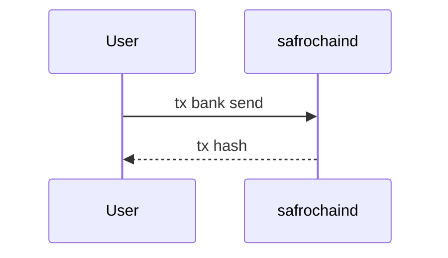

# Contributing to Safrochain Docs

First — thank you. The reason Safrochain documentation is good is that
people like you take time to make it better. This guide explains how
contributions flow, what we expect, and how to ship a change quickly.

## TL;DR

1. Fork the repo and create a feature branch from `main`.
2. Edit markdown in `docs/` (or React in `src/`) — see
   [`README.md`](./README.md) for layout.
3. Run `npm run build` locally; the build is **strict** and fails on
   broken links, anchors, or YAML.
4. Open a Pull Request against `main` with a short, descriptive title.
5. CI runs build + typecheck + lint; a maintainer reviews; on merge the
   site auto-deploys.

## What we welcome

| Contribution | Examples |
| --- | --- |
| **Typo & grammar fixes** | clearer wording, fixing dead links |
| **Clarifications** | adding examples, expanding a paragraph that is too dense |
| **New pages** | a guide we are missing — open an issue first to discuss the slot |
| **Code samples** | tested, copy-pasteable `bash` / `toml` / `json` blocks |
| **Diagrams** | Mermaid or ASCII; SVG accepted under `static/img/` |
| **Translations** | start a discussion before opening a translation PR |
| **Bug reports** | rendering issues, broken builds, accessibility problems |

## What we will likely close

- "Drive-by" content rewrites with no `npm run build` run locally.
- Edits that change foundation policy, tokenomics, or governance copy
  without a corresponding governance proposal or foundation sign-off.
- Style-only churn (rewrap, comma juggling) that does not improve
  clarity.
- Adding an em dash. Use `:`, `,`, or `;`.

## Project setup

```bash
git clone https://github.com/<your-fork>/docs.git safrochain-docs
cd safrochain-docs
npm install
npm start            # http://localhost:3000
```

Use the Node version pinned in [`.nvmrc`](./.nvmrc):

```bash
nvm install
nvm use
```

## Branching & commits

- Branch off `main`. Name branches with a short prefix:
  `docs/`, `fix/`, `feat/`, `chore/`, e.g.
  `docs/validators-grafana-dashboard`.
- Keep one logical change per branch. Smaller PRs review faster.
- We use **Conventional Commits** for the merge commit subject so the
  changelog can be auto-generated. Format:

  ```text
  type(scope): short description

  Optional body — what & why, not how.
  ```

  Common types: `docs`, `fix`, `feat`, `chore`, `ci`, `refactor`,
  `style`, `test`, `revert`.

  Examples:

  ```text
  docs(validators): add Grafana dashboard JSON snippet
  fix(networks): correct testnet RPC port
  feat(home): redesign architecture diagram
  ```

  Inside the PR you can write any number of commits in any style; the
  squash-merge subject is what becomes the conventional commit on
  `main`.

## Style guide

A page is well-written when an operator can copy commands, run them,
and the system behaves the way the page claims. Optimise for that.

### Markdown

- 2-space indent, no tabs, **no trailing whitespace**.
- One sentence per line where possible (cleaner diffs).
- Use ATX headings (`##`), never set-ext (underlined) headings.
- Wrap prose at ~80 columns when convenient; do not break code blocks.
- Tables: pipe-aligned, with a separator row, and a trailing newline
  after the table.

### Frontmatter

Every doc page must declare:

```md
---
title: <page title in title case>
description: <one or two sentence summary>
sidebar_position: <integer>
keywords:
  - <kw 1>
  - <kw 2>
---
```

If `description` (or any value) contains a colon, **wrap it in double
quotes**. Otherwise YAML breaks.

### Code samples

- Always include a language tag: ` ```bash `, ` ```toml `, ` ```yaml `,
  ` ```json `, ` ```text `, ` ```mermaid `, ` ```go `.
- Avoid leading `$` in `bash` blocks; the user copy-pastes the line.
- For multi-step shell sessions, use a single fenced block with `# 1.`
  numbered comments rather than many tiny blocks.
- Replace your real addresses, IPs, and tokens with the canonical
  placeholders below.

| Placeholder | Use for |
| --- | --- |
| `addr_safro1exampleexampleexampleexampleexample` | account address |
| `addr_safrovaloper1example…` | validator operator address |
| `addr_safrovalcons1example…` | validator consensus address |
| `<your_node_id>` | 40-char CometBFT node ID |
| `<rpc_endpoint>` | RPC URL the user must replace |

### Cross-references

- Internal: relative path **without** `.md`, e.g.
  `[Slashing & jail](./slashing)`.
- External: full `https://` URL.
- **Do not** link to draft Notion pages, internal Slack threads, or
  Loom videos behind a login wall.

### Punctuation we avoid

| Don't | Do |
| --- | --- |
| `—` (em dash) | `:` for explanation, `,` for parenthetical, `;` for list joins |
| `…` (ellipsis char) | `...` (three dots) |
| Smart quotes (`"…"`, `'…'`) | straight quotes (`"…"`, `'…'`) |

The em-dash rule is a hard build rule for new pages — see
[`README.md`](./README.md#style-conventions).

### Diagrams

Use Mermaid for sequence diagrams, ER diagrams, and flow charts:

````md

````

Use ASCII for small topologies that would be visually heavier as a
Mermaid graph. Use SVG (committed under `static/img/`) only when
neither works.

## Pull request flow

1. **Open a PR against `main`.** Fill out the PR template — it asks for
   *what changed*, *why*, and *how to verify*.
2. **CI runs** `npm run build`, `npm run typecheck`, `npm run lint`.
   All three must pass.
3. **Vercel posts a preview URL** as a PR comment. Click it; sanity
   check your changes render correctly.
4. **A maintainer reviews.** Expect comments — most are small style
   fixes. Push more commits to the same branch; the preview URL
   updates automatically.
5. **Squash-merge.** The maintainer sets the conventional-commit
   subject; the body becomes the merge commit body.

### When a PR is ready to review

- [ ] `npm run build` passes locally
- [ ] `npm run typecheck` and `npm run lint` pass
- [ ] No em dashes in new or changed prose
- [ ] Frontmatter present (title, description, sidebar_position, keywords)
- [ ] Code samples copy-paste cleanly into a fresh shell
- [ ] Cross-links use relative paths without `.md`
- [ ] If you added a page, you also added it to `sidebars.ts`
- [ ] Screenshots / diagrams committed under `static/img/`, not
      embedded as base64

### Reviewing checklist (for maintainers)

- Does the page solve a real operator question?
- Are the commands tested on a clean machine?
- Are the links live? (CI will catch broken **internal** links; check
  external links manually.)
- Does the writing carry our voice — direct, plainspoken, technically
  accurate, no hype?
- Does it duplicate content already covered elsewhere? If so, link
  rather than copy.

## Reporting bugs in the docs

Open an issue using the **Docs issue** template. Include:

- The URL of the page
- The browser & OS (for rendering issues)
- The exact text that is wrong, and what it should say
- (Optional) a screenshot

We aim to acknowledge issues within 3 business days.

## Reporting security issues

**Do not** open public issues for security problems — in the docs or
in the chain. Follow [`SECURITY.md`](./SECURITY.md).

## License of contributions

By submitting a contribution, you agree that your work is licensed
under the [Apache License, Version 2.0](./LICENSE), the same license
as this repository.

## Recognition

Significant contributors are listed in [`AUTHORS.md`](./AUTHORS.md). If
your contribution belongs there and we missed it, open a PR adding
yourself.

## Questions?

If something here is unclear, the contribution process *itself* is a
bug — open an issue and we'll fix this guide.
