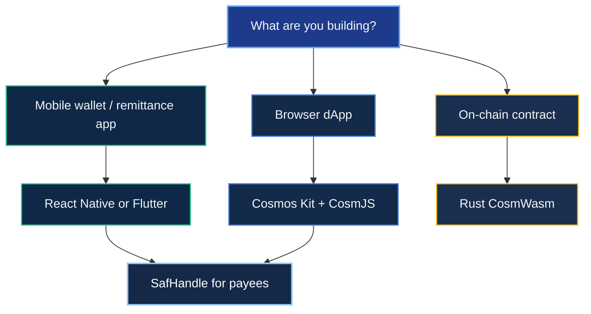

Pick the stack that matches your users and team skills. Most production apps combine **mobile UI** + **SafHandle** + **wallet signing**.

## Stack comparison

| Stack | Best for | Signing | SafHandle |
| --- | --- | --- | --- |
| **Flutter** | iOS + Android from one codebase | CosmJS (embedded JS) or Cosmos Kit WC | `@safrochaindev/safhandle` |
| **React Native** | JS team, Expo | CosmJS + SecureStore | Same as web SDK |
| **Web (CosmJS)** | Dashboards, backends, scripts | Mnemonic (dev) or wallet signer | `@safrochaindev/safhandle` |
| **Cosmos Kit** | Browser dApps with wallet modal | Keplr / Leap / Cosmostation | Pair with SafHandle resolve |
| **CosmWasm (Rust)** | On-chain contracts only | N/A (deploy via CLI) | SafHandle contract on chain |

## Decision guide

## Recommended combinations

| App type | Stack |
| --- | --- |
| Consumer mobile wallet | Flutter or RN + CosmJS or Cosmos Kit + [SafHandle](../safhandle) |
| Web checkout | Cosmos Kit + CosmJS + SafHandle |
| Backend service | CosmJS + REST (no wallet UI) |
| Custom on-chain logic | [Build in Rust](./../smart-contracts/build-in-rust) + [interact from apps](./../smart-contracts/interact-from-apps) |

## Not for app developers

| Technology | Use case | Docs |
| --- | --- | --- |
| **Go** | Cosmos SDK chain modules (`safrochaind`) | [Infra: modules](/modules/overview) |
| **CLI only** | Debugging, genesis, node ops | [CLI overview](/cli/overview) |

## Next steps

- [Testnet setup](./testnet-setup): faucet, endpoints, funded wallet
- [First transaction](./first-transaction): send 1 `usaf` on testnet
