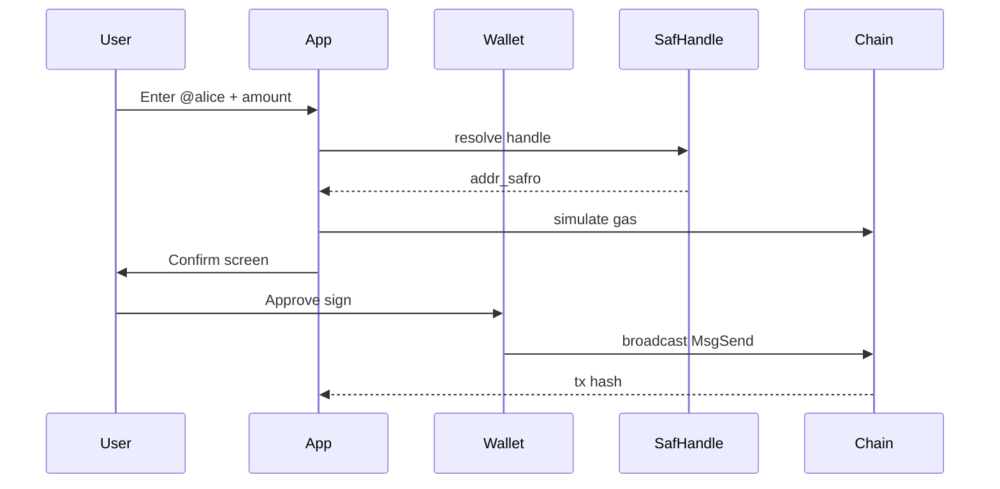

Production send flow for remittance and wallet apps.



import Tabs from '@theme/Tabs';
import TabItem from '@theme/TabItem';

<Tabs groupId="platform" defaultValue="web">
  <TabItem value="web" label="Web">

```ts
// 1. Resolve: safHandle.getAddress('alice') — see ../safhandle/resolve
// 2. Connect signer: Cosmos Kit or CosmJS
// 3. Simulate + sign + broadcast
const res = await client.sendTokens(
  sender,
  resolvedAddress,
  [{ denom: 'usaf', amount: '1000000' }],
  'auto',
  'payment memo',
);
```

See [Resolve handles](../safhandle/resolve) and [Register](../safhandle/register).

  </TabItem>
  <TabItem value="react-native" label="React Native">

Same steps with CosmJS + SecureStore or WalletConnect signer. Follow [Keys and UX](../mobile/keys-and-ux) for confirm screen copy.

  </TabItem>
  <TabItem value="flutter" label="Flutter (CosmJS)">

```ts
// 1. Resolve: safHandle.getAddress('alice')
// 2. Connect signer: CosmJS or Cosmos Kit WalletConnect
// 3. Simulate + sign + broadcast
const res = await client.sendTokens(
  sender,
  resolvedAddress,
  [{ denom: 'usaf', amount: '1000000' }],
  'auto',
  'payment memo',
);
```

See [Flutter guide](../mobile/flutter) and [SafHandle resolve](../safhandle/resolve).

  </TabItem>
</Tabs>

## Checklist

- [ ] Show resolved address before sign
- [ ] Display fee estimate from simulate
- [ ] Handle sequence errors with account refresh
- [ ] Link tx hash to [explorer](https://explorer.safrochain.com)

## Related

- [SafHandle resolve](../safhandle/resolve)
- [Simulate gas](../transactions/simulate-gas-fees)
