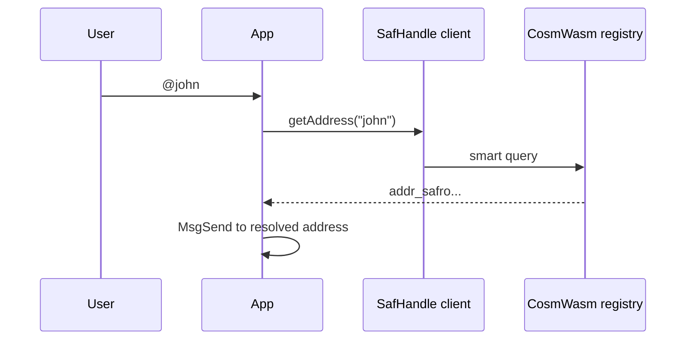

**SafHandle** maps short names (`@john`) and phone numbers to `addr_safro` addresses via an on-chain CosmWasm registry. Use it in mobile and web apps so users never paste 45-character addresses.

:::info Status
The `@safrochaindev/safhandle` npm package is in **spec / docs phase**. Canonical API docs live on [GitHub](https://github.com/Safrochain-Org/safhandle-sdk). npm publish is upcoming.
:::

## Why SafHandle?

| Raw address | SafHandle |
| --- | --- |
| Hard to verify | Short `@name` |
| Copy/paste errors | QR + deep links |
| Poor share UX | Pay links in chat apps |

## Hero: resolve a handle

Full guide: [Resolve handles](/developers/safhandle/resolve).

import Tabs from '@theme/Tabs';
import TabItem from '@theme/TabItem';

<Tabs groupId="platform" defaultValue="web">
  <TabItem value="web" label="Web (TypeScript)">

```ts
import { SafHandle } from '@safrochaindev/safhandle';

const safHandle = new SafHandle({ network: 'safrochain-testnet' });
const address = await safHandle.getAddress('john');
// addr_safro1...
```

Then build `MsgSend` with the resolved address. See [Interact from apps](/developers/smart-contracts/interact-from-apps).

  </TabItem>
  <TabItem value="react-native" label="React Native">

```ts
// Same @safrochaindev/safhandle package when published to npm.
// Until then, wasm smart query via REST (see interact-from-apps).
import { SafHandle } from '@safrochaindev/safhandle';

const safHandle = new SafHandle({ network: 'safrochain-testnet' });
const address = await safHandle.getAddress('john');
```

  </TabItem>
  <TabItem value="flutter" label="Flutter (CosmJS)">

```ts
import { SafHandle } from '@safrochaindev/safhandle';

const safHandle = new SafHandle({ network: 'safrochain-testnet' });
const address = await safHandle.getAddress('john');
```

Bundle via `flutter_js` or use the same npm package in a shared TS module. See [Flutter guide](/developers/mobile/flutter).

  </TabItem>
</Tabs>

## Resolution flow



## Why use the SDK?

| Benefit | Detail |
| --- | --- |
| Network-aware | Testnet vs mainnet config built in |
| Typed API | Resolve, validate, format handles |
| Contract alignment | Matches [safhandle-contract](https://github.com/Safrochain-Org/safhandle-contract) messages |

## SDK operations

| Operation | Method | Page |
| --- | --- | --- |
| Resolve `@name` or phone | `getAddress()` | [Resolve](/developers/safhandle/resolve) |
| Register short name | `registerName()` | [Register](/developers/safhandle/register) |
| Link phone (Phase 2) | `linkPhone()` | [Register](/developers/safhandle/register#phone-linking-phase-2) |
| Transfer name | `transferName()` | [Manage](/developers/safhandle/manage) |
| Release name | `releaseName()` | [Manage](/developers/safhandle/manage) |
| Read fees | `getConfig()` | [Manage](/developers/safhandle/manage#read-contract-config) |
| Validate input | `isValidName()`, `normalizeName()` | [Resolve](/developers/safhandle/resolve#validation-helpers) |

## Registration fees (on-chain)

| Handle type | Fee (approx.) |
| --- | --- |
| Name (`@john`) | 50 SAF |
| Phone number | 100 SAF |

Fees are paid in `usaf` at registration time on chain.

## Canonical documentation (GitHub)

| Topic | Link |
| --- | --- |
| Getting started | [safhandle-sdk README](https://github.com/Safrochain-Org/safhandle-sdk) |
| API reference | [SDK docs folder](https://github.com/Safrochain-Org/safhandle-sdk/tree/main/docs) |
| Integration guide | [Integration](https://github.com/Safrochain-Org/safhandle-sdk/blob/main/docs/integration.md) |
| Wallet integration | [Wallet integration](https://github.com/Safrochain-Org/safhandle-sdk/blob/main/docs/wallet-integration.md) |
| Architecture | [Architecture](https://github.com/Safrochain-Org/safhandle-sdk/blob/main/docs/architecture.md) |
| Contract | [safhandle-contract](https://github.com/Safrochain-Org/safhandle-contract) |

## Related

- [Resolve handles](/developers/safhandle/resolve): `getAddress`, validation, caching, errors
- [Register names](/developers/safhandle/register): `registerName`, fees, CosmJS execute
- [Transfer and release](/developers/safhandle/manage): ownership changes, reverse lookup
- [Payments flow](/developers/integrations/payments-flow): wallet → SafHandle → sign
- [Interact from apps](/developers/smart-contracts/interact-from-apps): raw `MsgExecuteContract`
- Partnerships: [team@safrochain.com](mailto:team@safrochain.com)
