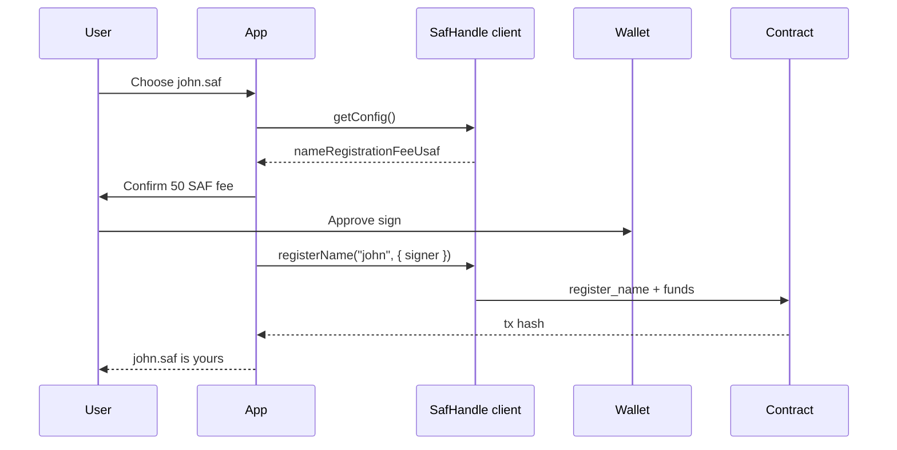

Registration binds a short name (e.g. `john.saf`) to the signer's `addr_safro` on chain. Default fee: **50 SAF** (`50000000` usaf), routed to the dev module wallet.

:::info v1 scope
Testnet v1 supports **name registration only**. Phone linking (`linkPhone`) is Phase 2 and not in the current wasm build. See [contract PHONE_LINKING](https://github.com/Safrochain-Org/safhandle-contract/blob/main/docs/PHONE_LINKING.md).
:::

## Registration flow



import Tabs from '@theme/Tabs';
import TabItem from '@theme/TabItem';

## SDK: registerName

<Tabs groupId="platform" defaultValue="web">
  <TabItem value="web" label="Web (Cosmos Kit + SDK)">

```ts
import { SafHandle } from '@safrochaindev/safhandle';
import { useChain } from '@cosmos-kit/react';

const safHandle = new SafHandle({ network: 'safrochain-testnet' });
const { getOfflineSigner } = useChain('safro-testnet-1');

async function registerJohn() {
  const config = await safHandle.getConfig();
  console.log('Fee:', config.nameRegistrationFeeUsaf, 'usaf');

  const signer = await getOfflineSigner();
  const tx = await safHandle.registerName('john', {
    signer,
    gas: 'auto',
    memo: 'register john.saf',
  });
  console.log(tx.transactionHash);
}
```

  </TabItem>
  <TabItem value="react-native" label="React Native">

```ts
import { SafHandle } from '@safrochaindev/safhandle';
// signer from CosmJS wallet or WalletConnect offline signer

await safHandle.registerName('john', {
  signer: offlineSigner,
  gas: 'auto',
});
```

Validate with `isValidName()` on each keystroke. Show **50 SAF**, not `50000000 usaf`, on the confirm screen.

  </TabItem>
  <TabItem value="flutter" label="Flutter (CosmJS)">

```ts
await safHandle.registerName('john', {
  signer: offlineSigner,
  gas: 'auto',
});
```

Use the same SDK in a bundled TS module. External wallets: Cosmos Kit WalletConnect.

  </TabItem>
</Tabs>

## CosmJS: MsgExecuteContract

Direct execute when not using the SDK wrapper:

<Tabs groupId="platform" defaultValue="web">
  <TabItem value="web" label="Web (TypeScript)">

```ts
import { MsgExecuteContract } from 'cosmjs-types/cosmwasm/wasm/v1/tx';
import { SigningCosmWasmClient } from '@cosmjs/cosmwasm-stargate';

const CONTRACT = 'addr_safro1j6n2q333gy80pmpd6avss32y4nhd8deayv8m9x4uazt6zkdczk9sxjfun6';
const FEE_AMOUNT = '50000000'; // 50 SAF

const msg = {
  typeUrl: '/cosmwasm.wasm.v1.MsgExecuteContract',
  value: MsgExecuteContract.fromPartial({
    sender: address,
    contract: CONTRACT,
    msg: new TextEncoder().encode(
      JSON.stringify({ register_name: { name: 'john.saf' } }),
    ),
    funds: [{ denom: 'usaf', amount: FEE_AMOUNT }],
  }),
};

const client = await SigningCosmWasmClient.connectWithSigner(RPC, offlineSigner, {
  gasPrice: { denom: 'usaf', amount: '0.05' },
});
const result = await client.signAndBroadcast(address, [msg], 'auto');
```

**Funds must exactly match** `name_registration_fee_usaf` from `getConfig()` or a config query.

  </TabItem>
  <TabItem value="react-native" label="React Native">

Same `MsgExecuteContract` shape as web. Attach `funds: [{ denom: 'usaf', amount: '50000000' }]` plus gas for the tx.

  </TabItem>
  <TabItem value="flutter" label="Flutter (CosmJS)">

Same message JSON and funds array. Sign and broadcast via your embedded CosmJS module.

  </TabItem>
</Tabs>

## Registration UX checklist

| Step | Recommendation |
| --- | --- |
| Input | Live `isValidName()` validation |
| Fee | Display `50 SAF` from `getConfig()` |
| Confirm | Show normalized name `john.saf` + fee + signer address |
| Success | Link to [explorer](https://explorer.safrochain.com) tx |
| Errors | Map `NameTaken`, `ReservedName`, `InsufficientFee` to clear copy |

Common contract errors: [CONTRACT_API](https://github.com/Safrochain-Org/safhandle-contract/blob/main/docs/CONTRACT_API.md).

## Phone linking (Phase 2)

When the phone feature ships:

```ts
await safHandle.linkPhone('+243899123456', {
  signer: offlineSigner,
  gas: 'auto',
});
// Default fee: 100 SAF (100000000 usaf)
```

Warn users that phone numbers are **public on chain**. Verification flow: [SDK phone verification](https://github.com/Safrochain-Org/safhandle-sdk/blob/main/docs/PHONE_VERIFICATION.md).

## CLI (dev / ops)

```bash
CONTRACT=addr_safro1j6n2q333gy80pmpd6avss32y4nhd8deayv8m9x4uazt6zkdczk9sxjfun6

safrochaind tx wasm execute "$CONTRACT" \
  '{"register_name":{"name":"john.saf"}}' \
  --amount 50000000usaf \
  --from dev \
  --chain-id safro-testnet-1 \
  --node https://rpc.testnet.safrochain.com:443 \
  --gas auto --gas-adjustment 1.3 --gas-prices 0.05usaf \
  -y
```

## Next steps

- [Resolve handles](/developers/safhandle/resolve)
- [Transfer and release](/developers/safhandle/manage)
- [Wallet integration](https://github.com/Safrochain-Org/safhandle-sdk/blob/main/docs/WALLET_INTEGRATION.md)
