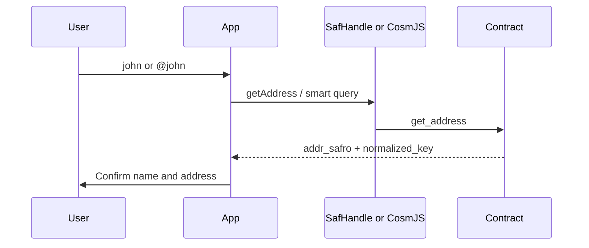

Use **resolve** before every send-by-name flow. The SafHandle contract maps `john` / `john.saf` to an `addr_safro` address. Phone linking is **Phase 2** on testnet v1 (names only today).

:::info Contract on testnet
`safro-testnet-1` contract: `addr_safro1j6n2q333gy80pmpd6avss32y4nhd8deayv8m9x4uazt6zkdczk9sxjfun6` ([config](https://github.com/Safrochain-Org/safhandle-contract/blob/main/config/testnet.json))
:::

## Resolution flow



**Always show the resolved address** (truncated) on the confirm screen before signing `MsgSend`.

import Tabs from '@theme/Tabs';
import TabItem from '@theme/TabItem';

## SDK: getAddress

<Tabs groupId="platform" defaultValue="web">
  <TabItem value="web" label="Web (TypeScript)">

```ts
import { SafHandle } from '@safrochaindev/safhandle';

const safHandle = new SafHandle({ network: 'safrochain-testnet' });

const result = await safHandle.getAddress('john');
// {
//   address: 'addr_safro1...',
//   recordType: 'name',
//   normalizedKey: 'john.saf',
//   verified: null
// }

const recipient = result.address;
```

  </TabItem>
  <TabItem value="react-native" label="React Native">

```ts
import { SafHandle } from '@safrochaindev/safhandle';

const safHandle = new SafHandle({ network: 'safrochain-testnet' });
const { address, normalizedKey } = await safHandle.getAddress('john');

// Show: Send to john.saf → addr_safro1...xyz
```

  </TabItem>
  <TabItem value="flutter" label="Flutter (CosmJS)">

```ts
import { SafHandle } from '@safrochaindev/safhandle';

const safHandle = new SafHandle({ network: 'safrochain-testnet' });
const { address } = await safHandle.getAddress('john');
```

Bundle the same npm package in a JS runtime. See [Flutter guide](/developers/mobile/flutter).

  </TabItem>
</Tabs>

### ResolveResult fields

| Field | Meaning |
| --- | --- |
| `address` | Resolved `addr_safro` bech32 |
| `recordType` | `'name'` or `'phone'` (phone when Phase 2 is live) |
| `normalizedKey` | Canonical key, e.g. `john.saf` |
| `verified` | `null` for names; boolean for phones (Phase 2) |

### Specialized queries

```ts
await safHandle.resolveName('john');   // name-only
await safHandle.resolvePhone('+243899123456'); // Phase 2
await safHandle.getConfig();             // fees + dev wallet
```

## CosmJS without SDK

Use when the npm package is not yet wired into your app:

<Tabs groupId="platform" defaultValue="web">
  <TabItem value="web" label="Web (CosmJS)">

```ts
import { CosmWasmClient } from '@cosmjs/cosmwasm-stargate';

const RPC = 'https://rpc.testnet.safrochain.com:443';
const CONTRACT = 'addr_safro1j6n2q333gy80pmpd6avss32y4nhd8deayv8m9x4uazt6zkdczk9sxjfun6';

const client = await CosmWasmClient.connect(RPC);
const result = await client.queryContractSmart(CONTRACT, {
  get_address: { input: 'john' },
});
// { address, record_type, normalized_key }
```

  </TabItem>
  <TabItem value="react-native" label="React Native">

Same `CosmWasmClient.queryContractSmart` call as web. Prefer the SDK for normalization and typed errors when available.

  </TabItem>
  <TabItem value="flutter" label="Flutter (CosmJS)">

```ts
// REST smart query alternative
const query = btoa(JSON.stringify({ get_address: { input: 'john' } }));
const res = await fetch(
  `https://rest.testnet.safrochain.com/cosmwasm/wasm/v1/contract/${CONTRACT}/smart/${query}`,
);
const { data } = await res.json();
```

  </TabItem>
</Tabs>

## Classify user input

Detect whether the user typed a name, raw address, or (later) phone:

```ts
import { isValidPhone, isValidName, isSafroAddress } from '@safrochaindev/safhandle';

function classifyInput(input: string): 'name' | 'phone' | 'address' {
  const trimmed = input.trim().replace(/^@/, '');
  if (isSafroAddress(trimmed)) return 'address';
  if (trimmed.startsWith('+') && isValidPhone(trimmed)) return 'phone';
  if (isValidName(trimmed)) return 'name';
  return 'name'; // let getAddress return INVALID_INPUT if bad
}

async function resolveRecipient(input: string): Promise<string> {
  const kind = classifyInput(input);
  if (kind === 'address') return input.trim();
  const { address, verified } = await safHandle.getAddress(input);
  if (kind === 'phone' && verified === false) {
    throw new Error('Phone number is not verified');
  }
  return address;
}
```

## Validation helpers

| Function | Example |
| --- | --- |
| `normalizeName('John')` | `john.saf` |
| `isValidName('john')` | `true` |
| `normalizePhone('+243 899 123 456')` | E.164 digits for contract |
| `isValidPhone('+243899123456')` | `true` |

Name rules: [contract NAME_RULES](https://github.com/Safrochain-Org/safhandle-contract/blob/main/docs/NAME_RULES.md).

## Caching

| Data | TTL | Notes |
| --- | --- | --- |
| Name resolution | ~60s | Re-resolve before high-value sends |
| Config (fees) | ~5 min | Refresh on registration screens |
| Phone status | ~30s | Do not cache across send sessions |

Stale resolution is a funds-loss risk if the owner transferred the name.

## Errors

| Error | When | UX |
| --- | --- | --- |
| `SafHandleNotFoundError` | Name not registered | Suggest register or check spelling |
| `SafHandleInvalidInputError` | Failed validation | Inline field error |
| `SafHandleNetworkError` | RPC down | Retry + endpoint health |
| `SafHandleContractError` | On-chain reject | Show contract message |

Full reference: [SDK error handling](https://github.com/Safrochain-Org/safhandle-sdk/blob/main/docs/ERROR_HANDLING.md).

## Next steps

- [Register a name](/developers/safhandle/register)
- [Payments flow](/developers/integrations/payments-flow)
- [Interact from apps](/developers/smart-contracts/interact-from-apps)
