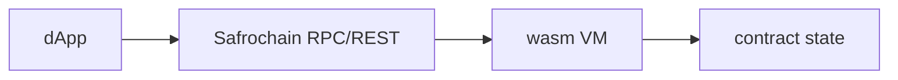

dApps talk to contracts via **smart queries** (read) and **MsgExecuteContract** (write).



import Tabs from '@theme/Tabs';
import TabItem from '@theme/TabItem';

<Tabs groupId="platform" defaultValue="web">
  <TabItem value="web" label="Web (CosmJS)">

```ts
import { MsgExecuteContract } from 'cosmjs-types/cosmwasm/wasm/v1/tx';

const msg = {
  typeUrl: '/cosmwasm.wasm.v1.MsgExecuteContract',
  value: MsgExecuteContract.fromPartial({
    sender: address,
    contract: contractAddr,
    msg: new TextEncoder().encode(JSON.stringify({ transfer: { recipient, amount } })),
    funds: [],
  }),
};

const result = await client.signAndBroadcast(address, [msg], 'auto');
```

Smart query via REST:

```bash
curl -s "$REST/cosmwasm/wasm/v1/contract/$ADDR/smart/$QUERY_B64"
```

  </TabItem>
  <TabItem value="react-native" label="React Native">

Same `MsgExecuteContract` structure as web. Encode JSON msg with `TextEncoder` (available in RN).

For SafHandle resolve, call smart query then pass address to `sendTokens`.

  </TabItem>
  <TabItem value="flutter" label="Flutter (CosmJS)">

```ts
import { MsgExecuteContract } from 'cosmjs-types/cosmwasm/wasm/v1/tx';

const msg = {
  typeUrl: '/cosmwasm.wasm.v1.MsgExecuteContract',
  value: MsgExecuteContract.fromPartial({
    sender: address,
    contract: contractAddr,
    msg: new TextEncoder().encode(JSON.stringify({ resolve: { name: 'john' } })),
    funds: [],
  }),
};

const result = await client.signAndBroadcast(address, [msg], 'auto');
```

Same CosmJS `MsgExecuteContract` shape as web. Smart queries use REST or `StargateClient` helpers.

  </TabItem>
</Tabs>

## SafHandle example

1. [Resolve](../safhandle/resolve) `@john` via `getAddress` or smart query
2. Use returned `addr_safro` in `MsgSend`
3. To register: [Register names](../safhandle/register)
4. See [Payments flow](../integrations/payments-flow)

## Next

- [Local dev and testing](./local-dev-and-testing)
- [wasm module](/modules/wasm) (CLI reference)
