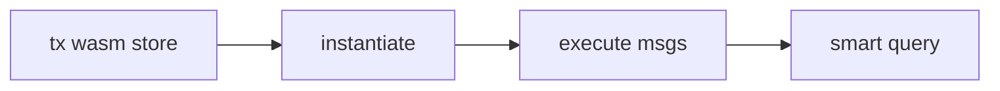

Safrochain runs **CosmWasm** via the [`wasm` module](/modules/wasm). App developers write contracts in **Rust**, compile to `.wasm`, and call them from CosmJS or REST.

:::tip Rust vs Go
**Rust** builds CosmWasm contracts. **Go** builds `safrochaind` chain modules (tokenfactory, feepay). App developers use Rust for contracts; Go docs live under [Infra](/modules/overview).
:::

## Lifecycle

| Step | Who | Tool |
| --- | --- | --- |
| Store code | Deployer | `safrochaind tx wasm store` |
| Instantiate | Deployer | `instantiate` / `instantiate2` |
| Execute | Users / dApps | `MsgExecuteContract` |
| Query | Anyone | REST smart query |

## Real on-chain examples

| Contract | Use |
| --- | --- |
| SafHandle registry | `@name` → address |
| FeePay | Sponsored transaction fees |
| Clock | Time-based contract logic |

## Curriculum

1. [Build in Rust](./build-in-rust)
2. [Deploy and manage](./deploy-and-manage)
3. [Interact from apps](./interact-from-apps)
4. [Local dev and testing](./local-dev-and-testing)
