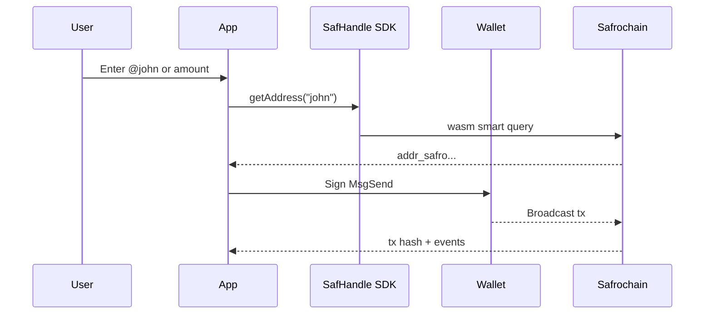

Welcome to the **Safrochain developer portal**. This section is for **app and integration developers**: wallets, remittance flows, dApps, and CosmWasm contracts. For nodes, validators, and CLI reference, use the [Infra](/intro) section.

## What is Safrochain for developers?

Safrochain is a **Cosmos SDK Layer-1** built for **mobile-first payments** and IBC-connected economies.

| Constant | Testnet | Mainnet |
| --- | --- | --- |
| Chain ID | `safro-testnet-1` | `safrochain-1` |
| Base denom | `usaf` | `usaf` |
| 1 SAF | `1_000_000 usaf` | `1_000_000 usaf` |
| Bech32 prefix | `addr_safro` | `addr_safro` |

You integrate via **RPC / REST**, **CosmJS** or **Cosmos Kit**, **mobile SDKs**, and **CosmWasm** smart contracts. Human-readable sends use [SafHandle](./safhandle).

## Why build here?

- **Low, predictable fees** via globalfee (see [chain constants](./reference/chain-constants))
- **IBC** to Noble (USDC) and Osmosis (see [IBC channels](/ibc/channels))
- **SafHandle**: `@name` and phone-to-address resolution ([hub](./safhandle))
- **CosmWasm** for on-chain logic (FeePay, tokenfactory, custom contracts)
- **Mobile-first** design for remittance and wallet apps across African markets

## Typical app flow

## Where to start?

| You are... | Start with |
| --- | --- |
| New to Safrochain | [Choose your stack](./get-started/choose-your-stack) |
| Building a mobile wallet or remittance app | [Flutter](./mobile/flutter) or [React Native](./mobile/react-native) |
| Adding `@name` or phone sends | [SafHandle hub](./safhandle) → [Resolve](./safhandle/resolve) |
| Registering a handle for your app | [Register a name](./safhandle/register) |
| Building a web dApp or dashboard | [CosmJS overview](./web/cosmjs) |
| Connecting Keplr / Leap in a browser | [Cosmos Kit](./wallets/cosmos-kit) |
| Signing and broadcasting transactions | [Transactions](./transactions/signing-overview) |
| Building or calling a smart contract | [Smart contracts](./smart-contracts/overview) |
| Need RPC / REST / curl first | [Testnet setup](./get-started/testnet-setup) or [Local devnet](./get-started/local-devnet) |

## Curriculum overview

1. **Get Started**: stack, testnet, first transaction
2. **Mobile**: Flutter, React Native, keys and UX
3. **SafHandle**: [hub](./safhandle), [resolve](./safhandle/resolve), [register](./safhandle/register)
4. **Wallets**: supported wallets, Cosmos Kit, browser connect
5. **Transactions**: sign, simulate gas, broadcast
6. **Smart Contracts**: Rust CosmWasm build, deploy, interact
7. **Web**: CosmJS queries
8. **Integrations**: IBC, payments flow, token factory
9. **Reference**: constants, endpoints, WebSocket events

## Quick links

- [Testnet endpoints](/networks/testnet-endpoints) · [Faucet](https://faucet.safrochain.com/)
- [SafHandle SDK on GitHub](https://github.com/Safrochain-Org/safhandle-sdk)
- [Chain registry](/networks/chain-registry)
