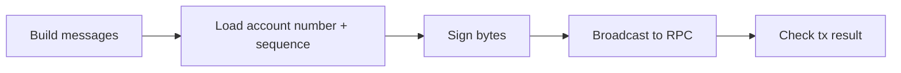

Every app integration follows the same pipeline:



**Never embed mnemonics in production apps.** Use Cosmos Kit, SecureStore (mobile), or hardware keys.

import Tabs from '@theme/Tabs';
import TabItem from '@theme/TabItem';

<Tabs groupId="platform" defaultValue="web">
  <TabItem value="web" label="Web (CosmJS)">

```ts
import { SigningStargateClient, assertIsDeliverTxSuccess } from '@cosmjs/stargate';

const client = await SigningStargateClient.connectWithSigner(RPC, offlineSigner, {
  gasPrice: { denom: 'usaf', amount: '0.05' },
});

const result = await client.signAndBroadcast(address, [msg], 'auto');
assertIsDeliverTxSuccess(result);
```

With Cosmos Kit, `offlineSigner` comes from `getOfflineSigner(chainId)`.

  </TabItem>
  <TabItem value="react-native" label="React Native">

Same CosmJS APIs. Load mnemonic from `expo-secure-store` only in self-custody wallets; prefer WalletConnect for external signers.

```ts
const result = await client.signAndBroadcast(address, [msg], 'auto');
assertIsDeliverTxSuccess(result);
```

  </TabItem>
  <TabItem value="flutter" label="Flutter (CosmJS)">

```ts
import { SigningStargateClient, assertIsDeliverTxSuccess } from '@cosmjs/stargate';

const client = await SigningStargateClient.connectWithSigner(RPC, offlineSigner, {
  gasPrice: { denom: 'usaf', amount: '0.05' },
});

const result = await client.signAndBroadcast(address, [msg], 'auto');
assertIsDeliverTxSuccess(result);
```

Same CosmJS APIs as web and React Native. For Keplr / Leap Mobile, use [Cosmos Kit WalletConnect](../wallets/cosmos-kit).

  </TabItem>
</Tabs>

## Signer sources

| Path | When |
| --- | --- |
| [Cosmos Kit](../wallets/cosmos-kit) | Browser dApp or mobile via WalletConnect |
| CosmJS `DirectSecp256k1HdWallet` | RN, Flutter (JS bridge), scripts, dev only |
| `safrochaind tx` | Debugging, CI, operators |

## Advanced authorization

| Feature | Infra docs |
| --- | --- |
| Fee grants (sponsor gas) | [CLI tx](/cli/tx), [feegrant module](/modules/feegrant) |
| Authz (delegate msgs) | [CLI tx](/cli/tx), [authz module](/modules/authz) |
| FeePay sponsored txs | [feepay module](/modules/feepay) |

## Next steps

- [Simulate gas and fees](./simulate-gas-fees)
- [Broadcast modes](./broadcast-modes)
