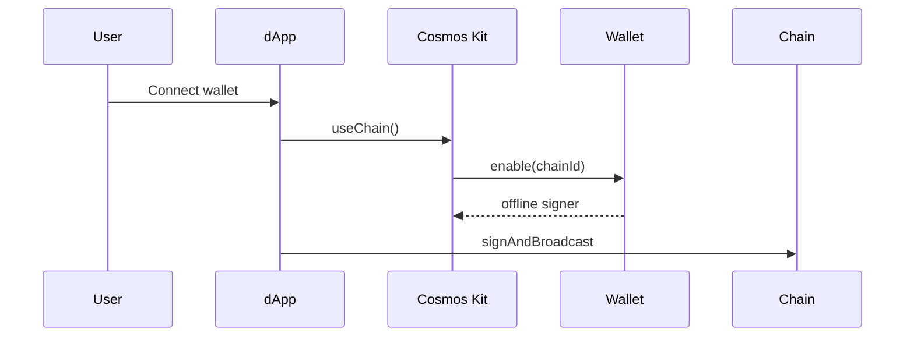

[Cosmos Kit](https://docs.hyperweb.io/cosmos-kit) provides a React `ChainProvider`, wallet modal, and offline signers for interchain dApps.

## Install

```bash
npm i @cosmos-kit/react @cosmos-kit/core chain-registry
npm i cosmos-kit
```

Or install individual wallet packages: `@cosmos-kit/keplr`, `@cosmos-kit/leap`, `@cosmos-kit/cosmostation`.

## Register Safrochain

Use chain metadata from [testnet endpoints](/networks/testnet-endpoints#wallet-connection-keplr--leap) or `chain-registry`:

```tsx
import { ChainProvider } from '@cosmos-kit/react';
import { wallets } from 'cosmos-kit';

const safroTestnet = {
  chainId: 'safro-testnet-1',
  chainName: 'Safrochain Testnet',
  bech32Prefix: 'addr_safro',
  // currencies, feeCurrencies, apis: copy from testnet-endpoints JSON
};

export function AppProvider({ children }: { children: React.ReactNode }) {
  return (
    <ChainProvider
      chains={[safroTestnet]}
      wallets={wallets.for('keplr', 'leap', 'cosmostation')}
      walletConnectOptions={{
        signClient: { projectId: process.env.NEXT_PUBLIC_WC_PROJECT_ID! },
      }}
    >
      {children}
    </ChainProvider>
  );
}
```

import Tabs from '@theme/Tabs';
import TabItem from '@theme/TabItem';

<Tabs groupId="platform" defaultValue="web">
  <TabItem value="web" label="Web (React)">

```tsx
import { useChain } from '@cosmos-kit/react';
import { SigningStargateClient } from '@cosmjs/stargate';

function SendButton() {
  const { address, getOfflineSigner } = useChain('safro-testnet-1');

  async function send() {
    const signer = await getOfflineSigner();
    const client = await SigningStargateClient.connectWithSigner(
      'https://rpc.testnet.safrochain.com:443',
      signer,
      { gasPrice: { denom: 'usaf', amount: '0.05' } },
    );
    await client.sendTokens(address!, address!, [{ denom: 'usaf', amount: '1' }], 'auto');
  }

  return <button onClick={send}>Send 1 usaf</button>;
}
```

  </TabItem>
  <TabItem value="react-native" label="React Native">

```tsx
// WalletConnect v2 + Cosmos Kit ChainProvider (Expo / RN)
<ChainProvider
  chains={[safroTestnet]}
  wallets={wallets.for('keplr', 'leap', 'cosmostation')}
  walletConnectOptions={{
    signClient: { projectId: process.env.EXPO_PUBLIC_WC_PROJECT_ID! },
  }}
  includeAllWalletsOnMobile
/>
```

See [React Native](../mobile/react-native) for CosmJS + SecureStore when not using an external wallet.

  </TabItem>
  <TabItem value="flutter" label="Flutter">

```ts
// Cosmos Kit is React-based. Flutter apps use WalletConnect to Keplr / Leap Mobile,
// or embed a small React/WebView shell with ChainProvider + CosmJS.
// Signing APIs match the web tab above once you have an offline signer.
```

See [Flutter integration](../mobile/flutter) for CosmJS bundling and WalletConnect patterns.

  </TabItem>
</Tabs>

## Connect flow



## Next steps

- [Signing overview](../transactions/signing-overview)
- [ChainProvider docs](https://docs.hyperweb.io/cosmos-kit/provider/chain-provider)
